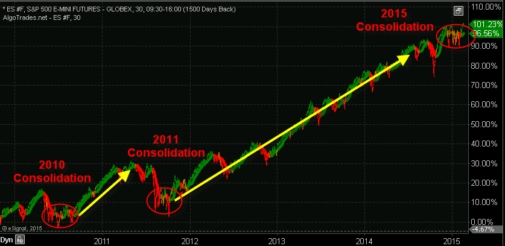

>## *Algorithmic Investing Analysis*  
#

 

#

>### Overview: 
>> Using the S&P 500 as a benchmark, this script will *Calculate* & *Evaluate* Algorithmic trading returns vs. traditional  investing.

>## Benefits of Algorithmic Trading Strategies
> [Data Science](https://medium.com/@matthewwang_91639/algorithmic-factor-investing-with-market-regime-classification-6bc2f8c7168b): Financial time series data often demonstrates the idea of volatility clustering, where the variance of returns of assets tend to persist over periods of time. We often identify these periods of time that have similar volatility and momentum levels as individual market regimes, as these periods tend to endure for a while after that first shock. Due to this phenomenon, identically distributed models are often inadequate in predicting returns or volatility.
>

 

## Resources:
1. Northwestern NPS:
https://sps.northwestern.edu/

2. Algorithmic Factor Investing (Medium):
https://medium.com/@matthewwang_91639/algorithmic-factor-investing-with-market-regime-classification-6bc2f8c7168b

